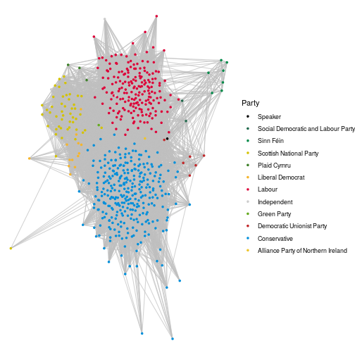
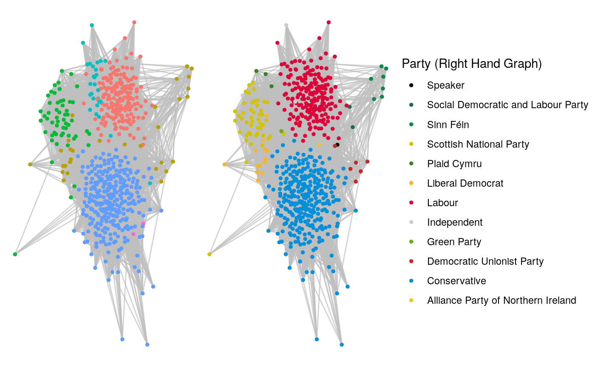
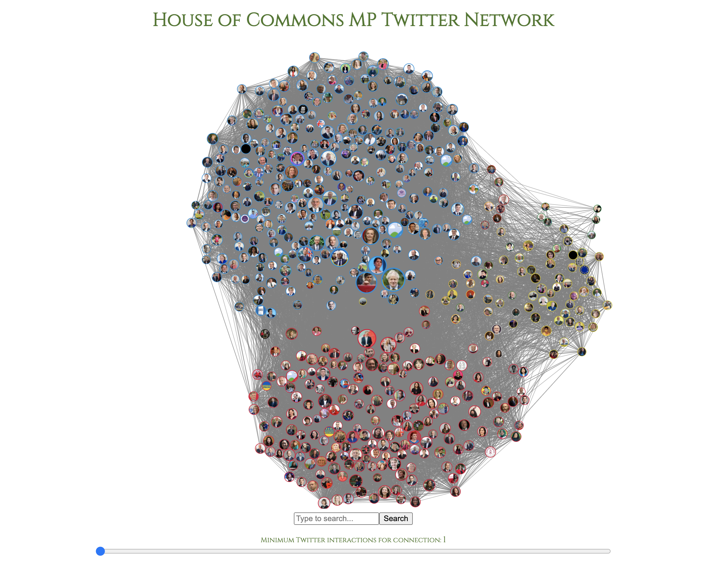

```{r setup, include=FALSE}
options(htmltools.dir.version = FALSE)
knitr::opts_chunk$set(warning = FALSE, message = FALSE)
```

class: left, middle, r-logo

## Notes

This document is coded in R.  The code for this document is [here](https://github.com/keithmcnulty/peopleanalytics-regression-book/tree/master/presentations/multinom_tidymodels.Rmd).  

Full explanations and resources for learning network analysis methods can be found at https://ona-book.org.

---
class: left, middle, r-logo

## Topics I'll cover today

* How to extract data from the Twitter API
* How to transform the data to create a network graph
* How to visualize and analyze the network graph in order to obtain insights about the network

---
class: left, middle, r-logo

## When might Twitter data be useful for understanding a network

1. *When all (or a large majority) of people in the network have active and public Twitter profiles* - otherwise it will not be possible to extract meaningful data about their Twitter activity

2. *When you believe that Twitter activity might be somewhat aligned with ground-truth interests and behaviors* that you are wanting to analyze.  If people use their Twitter accounts for purposes other than the topic you are interested in, then the data won't be very useful.

**In this example, we will analyze a network of Twitter interactions between British Members of Parliament (MPs)**.  Most MPs are very active on Twitter and use their accounts to discuss their work, so the network should be some reflection of ground truth political dynamics.  
 

---
class: left, middle, r-logo

# Extracting Twitter data

---
class: left, middle, r-logo

## The Twitter API

* The Twitter API allows the extraction of Twitter data programmatically.  Anyone with a Twitter account can access the API by setting up an application on the [Twitter Developer Platform](https://developer.twitter.com).

* When you set up an application, you'll be provided with credentials to use to integrate with the API.  

* There are two API versions - v1.1 and the newer more powerful v2.

* The API operates *rate limits*, which restrict the amount of data you can extract in 15 minute periods.  For example, the limit for the number of user timelines you can extract in a 15 minute period is 180.  Full details of the rate limits are [here](https://developer.twitter.com/en/docs/twitter-ads-api/rate-limiting).

* There are also overall limits depending on your access level.  I have elevated access and that means I have a limit of 2 million tweets per month that I can extract.


---
class: left, middle, r-logo

## The `rtweet` package

The `rtweet` package provides a super-convenient set of functions for accessing the Twitter API.  When you first use it you can set up an access token using your credentials and then it is permanently stored in your R environment.

```{r, eval = FALSE}
library(rtweet)

# set up access token using your app credentials
token <- create_token(
  app = "YOUR_APP_NAME",
  consumer_key = "YOUR_API_KEY",
  consumer_secret = "YOUR_API_KEY_SECRET",
  access_token = "YOUR_ACCESS_TOKEN",
  access_secret = "YOUR_ACCESS_TOKEN_SECRET"
)
```

---
class: left, middle, r-logo

## Extracting data

A variety of functions exist for extracting data from Twitter.  For example, I will use this function to get 10 followers of Chuck Norris.

```{r}
(chuck_followers <- rtweet::get_followers("chucknorris", 10))
```

---
class: left, middle, r-logo

## Extracting data

Those user IDs are not particularly useful.  We use the `lookup_users()` function to get a range of info about users.

```{r}
library(tidyverse)

# get some of user details
chuck_followers |> 
  dplyr::rowwise() |> 
  dplyr::mutate(
    screen_name = rtweet::lookup_users(user_id)$screen_name,
    name = rtweet::lookup_users(user_id)$name
  )
```

---
class: left, middle, r-logo

# Transforming data to create a network graph

---
class: left, middle, r-logo

## Twitter accounts of British MPs

Information on social media accounts of British political figures can be downloaded from the *Politics Social* website.

```{r}
# download MP list from Politics Social
url <- "https://www.politics-social.com/api/list/csv/party"
mp_list <- read.csv(url)
head(mp_list)
```

---
class: left, middle, r-logo

## Extracting timelines

The aim is to use Twitter activity to connect MPs to other MPs by means of replies, mentions or retweets.  To do this we will need to extract the timelines of each of the `r nrow(mp_list)` MPs in our list.  You can extract up to 3,200 tweets for each user, but for this analysis we will use the most recent 500 tweets for each MP.

We need to do this in batches of 180 at a time, and wait 15 mins in between so as not to breach rate limits.

```{r, eval = FALSE}
# get the 500 most recent tweets of the first 180 MPs to avoid rate limit
# this may take a while
results1 <- rtweet::get_timeline(
  user = mp_list$Screen.name[1:180],
  n = rep(500, 180)
)
```

```{r, echo = FALSE}
library(here)
results1 <- readRDS(here("results1.RDS"))
```

Once we have done this for each batch we will join the results together into a single dataframe.

---
class: left, middle, r-logo

## What data does this give us?

It gives us a lot of data about every tweet the user made.

```{r}
colnames(results1)
```

---
class: left, middle, r-logo

## Identifying interactions from tweets

The columns ending in `screen_name` tell us about interactions in a tweet.

```{r}
results1 |> 
  dplyr::select(ends_with("screen_name")) |> 
  head()
```

---
class: left, middle, r-logo

## Generating a list of interactions with other MPs

We can write a simple function that takes the screen name of a specific MP and returns the screen name of all other MPs they interacted with in their timeline, and the number of interactions with each.

```{r, eval = FALSE}
# function to create edgelist for single MP
count_and_group <- function (df) {
  df |> 
    dplyr::select(ends_with("screen_name")) |> 
    unlist() |> 
    tibble(interacted_with = _) |> 
    tidyr::drop_na() |> 
    dplyr::group_by(interacted_with) |> 
    dplyr::summarise(weight = n()) |> 
    dplyr::filter(
      # ensures that only MP interactions are returned
      interacted_with %in% substr(mp_list$Screen.name, 2, nchar(mp_list$Screen.name))
    )
}
```


---
class: left, middle, r-logo

## Applying this function across all MPs

We can run this function for all MPs and it will create an MP to MP edgelist with a weight on each edge according to the number of interactions.

```{r, echo = FALSE}
# if needed, download the results of the previous section as at May 2022 
mp_edgelist <- read.csv("https://ona-book.org/data/mp_edgelist.csv")
mp_vertices <- read.csv("https://ona-book.org/data/mp_vertices.csv") |> 
  dplyr::select(-colour)
```

```{r, eval = FALSE}
# function to generate edgelist across all MPs
create_edgelist <- function(tweet_df) {
  tweet_df |> 
    dplyr::nest_by(screen_name) |> 
    dplyr::summarise(count_and_group(data)) |> 
    # ignore interactions with self
    dplyr::filter(screen_name != interacted_with) |> 
    dplyr::rename(from = screen_name, to = interacted_with)
}

# run it on all our downloaded tweets to create final edgelist
mp_edgelist <- create_edgelist(results)
```

```{r}
head(mp_edgelist)
```


---
class: left, middle, r-logo

## Creating vertex details

Our MPs are our vertices, but we can gather some interesting info about them from the Twitter data which we can use as properties in our network.

```{r, eval = FALSE}
mp_vertices <- results %>%
  select(screen_name, profile_image_url, followers_count) %>%
  distinct() |> 
  left_join(
    mp_list |> 
      dplyr::mutate(
        screen_name = substr(Screen.name, 2, nchar(Screen.name))
      ) |> 
      dplyr::select(
        screen_name,
        constituency = Constituency,
        party = Party,
        name = Name
      )
  )
```

```{r}
head(mp_vertices, 3)
```

---
class: left, middle, r-logo

## Add official party colours

I'll want to color MPs according to their official political party colours in any visualization, so I got the official colours from *Politics Social* and will add them to our vertex dataframe.

```{r}
# add party colours from politics social
parties <- mp_vertices$party |> unique()
party_colours <- c("#000000", "#216a4d", "#008a49",
                   "#d3c200", "#3d8028", "#f5b52e",
                   "#dd0339", "#cccccc", "#66ab21",
                   "#c2282a", "#018fda", "#eec52e")

color_df <- data.frame(
  party = parties,
  colour = party_colours
)

# join to vertices
mp_vertices <- mp_vertices |> 
  left_join(color_df)

# check
head(mp_vertices, 3)
```

---
class: left, middle, r-logo

# Visualizing and analyzing the MP Twitter network

---
class: left, middle, r-logo

## Creating a graph object

Now we have an edgelist and a vertex dataframe, it's easy to create a graph object using `igraph`.  In this case I'm going to use an undirected network, so MPs are considered to have interacted if the tweet has gone in any direction.

```{r}
library(igraph)

(mp_graph_undirected <- igraph::graph_from_data_frame(
  mp_edgelist, 
  vertices = mp_vertices,
  directed = FALSE
))
```

---
class: left, middle, r-logo

## Creating a graph object

We can immediately use `ggraph` to visualize the network.  We'll group the MPs by their party and use a force directed layout and official party colors.

```{r, eval = FALSE}
library(ggraph)

# set seed to reproduce random generation
set.seed(123)

# visualize graph
(g2 <- ggraph(mp_graph_undirected, layout = "fr") +
  geom_edge_link(color = "grey", alpha = 0.7) + 
  geom_node_point(aes(color = factor(party)), size = 1) +
  theme_void() + 
  scale_colour_manual(limits = parties, 
                      values = party_colours, name = "Party")) 

```


---
class: left, middle, r-logo

## Let's take a look

```{r, echo = FALSE, fig.align = "center", out.height = "500"}

```


---
class: left, middle, r-logo

## Community detection

The Leiden Community Detection algorithm uses a measure called modularity to try to find a segmentation of the vertices such that vertices in each segment are more highly connected.  Let's ignore party groupings and see what groupings the Leiden algorithm would detect.

```{r}
# run leiden community detection algorithm
leiden_communities <- igraph::cluster_leiden(mp_graph_undirected,
                                             objective_function = "modularity")

# assign cluster as a vertex property
V(mp_graph_undirected)$cluster <- membership(leiden_communities)

# how many communities detected?
membership(leiden_communities) |> 
  unique() |> 
  length()
```

---
class: left, middle, r-logo

## Investigating the Leiden communities

There are many ways to investigate what these communities represent.  One way is to find out who the most central MP is in each community.

```{r}
tibble(community = 1:max(V(mp_graph_undirected)$cluster)) |> 
  dplyr::rowwise() |> 
  dplyr::mutate(
    highest_degree = induced_subgraph(
      mp_graph_undirected,
      vids = V(mp_graph_undirected)[V(mp_graph_undirected)$cluster == community]) |> 
      degree() |> 
      which.max() |> 
      names(),
    community_size = V(mp_graph_undirected)[V(mp_graph_undirected)$cluster == community] |> 
      length(),
    party = V(mp_graph_undirected)$party[V(mp_graph_undirected)$name == highest_degree]
  )
```

---
class: left, middle, r-logo

## How well does Leiden detect political party alignment?

We can use Jaccard similarity to calculate the overlap between Leiden communities and political parties.  For example, how well does community 5's edgelist align with the Conservative Party edgelist?

```{r}
leiden_5 <- V(mp_graph_undirected)[V(mp_graph_undirected)$cluster == 5]
conservatives <- V(mp_graph_undirected)[V(mp_graph_undirected)$party == "Conservative"]

# create induced subgraphs
leiden5_graph <- igraph::induced_subgraph(
  mp_graph_undirected,
  vids = leiden_5
)

conservative_graph <- igraph::induced_subgraph(
  mp_graph_undirected,
  vids = conservatives
)

# jaccard similarity
intersection <- E(leiden5_graph %s% conservative_graph)
union <- E(leiden5_graph %u% conservative_graph)

length(intersection)/length(union)

```

---
class: left, middle, r-logo

## Comparing visually

```{r leiden-comms-v-party, echo = FALSE, fig.align = "center"}

```

---
class: left, middle, r-logo

## Detecting cliques

Cliques are complete subgraphs of a graph, that is, where everyone is connected to everyone else. In this case they would represent groups of MPs who all interact with each other to some degree.  For example, we see that the largest clique in the Conservative party consist of members of the governing cabinet.

```{r}
(cliques <- igraph::largest_cliques(conservative_graph))
```

---
class: left, middle, r-logo

# Other fun stuff you can do

---
class: left, middle, r-logo

## Feeding Twitter data into `D3.js` for advanced visualizations

<center>
  <a href="https://ona-book.org/mp_twitter.html">
  
  </a>
</center>

---
class: left, middle, r-logo

# Thanks for listening!